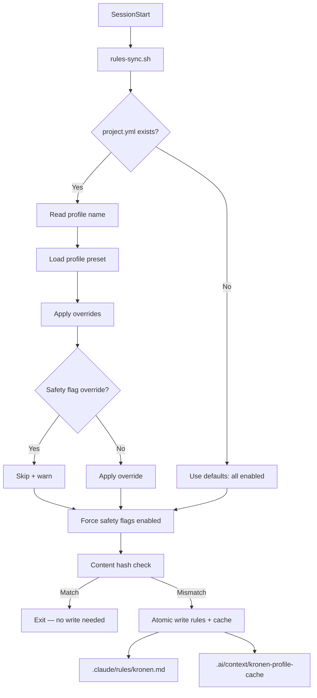

# Config System — Internal Reference

Unified configuration for the kronen plugin ecosystem. Replaces three previous systems (rules.yml per-hook config, .local.md freeform settings, and ad-hoc profile variables) with a single `project.yml` file, a profile preset layer, and a compiled cache that hooks source at runtime.

For the user-facing schema reference, see [project-config.md](./project-config.md).

---

## Architecture



The entry point is `plugins/kronen/scripts/rules-sync.sh`, registered as a `SessionStart` hook in `plugin.json`. It runs once per session, reads the project config, resolves the profile, compiles flags to a flat cache, and distributes the operating rules markdown to `.claude/rules/`.

---

## File Layout

| File | Purpose | Generated? | Gitignored? |
|------|---------|-----------|------------|
| `.ai/project.yml` | Project config (profile selection, dev commands, overrides) | No (committed) | No |
| `plugins/kronen/resources/operating-rules.md` | Rule template distributed to `.claude/rules/` | No (source) | No |
| `plugins/kronen/resources/profiles/schema.yml` | Profile field contract — all presets must implement every field | No (source) | No |
| `plugins/kronen/resources/profiles/work.yml` | Work preset: strict hooks, light tracing | No (source) | No |
| `plugins/kronen/resources/profiles/personal.yml` | Personal preset: minimal hooks, no tracing | No (source) | No |
| `.claude/rules/kronen.md` | Distributed rules (generated header + operating-rules.md content) | Yes (by rules-sync.sh) | Yes |
| `.ai/context/kronen-profile-cache` | Compiled flags as flat `KEY=VALUE` lines | Yes (by rules-sync.sh) | Yes |
| `.claude/rules/.kronen-sync-meta` | SHA-256 content hash for change detection | Yes (by rules-sync.sh) | Yes |

---

## Profile Resolution Chain

Resolution happens in four steps. Each layer overrides the previous.

### Step 1: Load profile preset

`rules-sync.sh` reads the `profile` field from `.ai/project.yml` and loads the matching file from `plugins/kronen/resources/profiles/{name}.yml`.

Profile name sanitization:
- Strip everything except `[a-zA-Z0-9_-]`
- Resolve the final path and verify it stays inside the profiles directory (path traversal check)
- If the profile file doesn't exist, fall through to defaults (all enabled)

### Step 2: Apply overrides with safety-flag skip

The script iterates over all known flag keys and checks for values under `overrides.hooks` in `project.yml`. For each override:

1. Check if the key is in the `SAFETY_FLAGS` array (`scope_guard`, `push_protection`)
2. If it is a safety flag and the value is not `enabled`, skip and log a warning
3. If it is a workflow flag, apply the override by setting the corresponding `KRONEN_*` variable

This is the allowlist-skip barrier. It prevents safety flags from being weakened through config.

### Step 3: Force safety flags

After all overrides are applied, safety flags are unconditionally set to `enabled`:

```bash
KRONEN_SCOPE_GUARD="enabled"
KRONEN_PUSH_PROTECTION="enabled"
```

This is the defense-in-depth barrier. Even if the allowlist-skip in step 2 were somehow bypassed (code bug, unexpected input), the force-set ensures safety flags cannot be disabled.

### Step 4: Compile to flat cache

All resolved flags are written to `.ai/context/kronen-profile-cache` as `KEY=VALUE` lines:

```
# kronen-profile-cache (auto-generated by rules-sync.sh — do not edit)
KRONEN_TDD_GATE=enabled
KRONEN_TRACING=light
KRONEN_DOC_CHECKPOINT=enabled
KRONEN_VERIFICATION=strict
KRONEN_SCOPE_GUARD=enabled
KRONEN_PUSH_PROTECTION=enabled
KRONEN_DEV_TEST=pnpm test
KRONEN_DEV_BUILD=pnpm build
KRONEN_DEV_LINT=pnpm lint
```

The cache is the single source of truth for all hook runtime decisions. Hooks never read `project.yml` directly.

---

## Security Model

### Path traversal sanitization

Profile names are sanitized in two stages:

1. **Character stripping** — `tr -cd 'a-zA-Z0-9_-'` removes all characters except alphanumerics, dashes, and underscores. After this step, slashes and dots are structurally impossible.
2. **Directory containment check** — the resolved path is compared against the real path of the profiles directory using `pwd -P`. If the resolved path escapes the profiles directory, the profile is rejected.

### Dev command validation

All values under `dev` (`test`, `build`, `lint`) are validated against:

```
/^[a-zA-Z0-9_./ -]+$/
```

This regex rejects shell metacharacters (`|`, `;`, `&`, `$`, backticks, parentheses). Commands that fail validation are replaced with empty strings and a warning is logged. This prevents command injection since dev commands are eventually executed by hooks via `eval` or direct invocation.

### Atomic writes

All file writes use the `atomic_write` function:

1. Check parent directory is not a symlink
2. `mkdir -p` the target directory
3. Write to a temp file in the same directory (`mktemp "$dir/.kronen-sync-XXXXXX"`)
4. `mv` temp file to target (atomic on same filesystem)
5. Post-mv verification: if the target is a symlink, remove it and abort
6. `chmod 600` on the final file

This prevents TOCTOU races and symlink attacks on the output files.

### Cache permissions

The script runs with `umask 077` and explicitly `chmod 600` every generated file. Cache files contain configuration that affects hook behavior — they should not be world-readable.

### Safety flag dual-barrier

Two independent mechanisms prevent safety flag override:

| Barrier | Location | Mechanism |
|---------|----------|-----------|
| Allowlist-skip | Step 2 (override loop) | `is_safety_flag()` check skips the override and warns |
| Force-set | Step 3 (post-override) | Unconditional assignment to `enabled` |

Both must fail for a safety flag to be disabled. They are independent code paths — a bug in one does not affect the other.

### Cache format validation

Hooks source the cache using a restricted `grep` + `eval` pattern:

```bash
eval "$(grep '^KRONEN_[A-Z_]*=' "$CACHE")"
```

The regex `^KRONEN_[A-Z_]*=` only matches lines starting with `KRONEN_` followed by uppercase letters and underscores, then `=`. This prevents arbitrary code execution from a tampered cache file — only valid `KRONEN_*` variable assignments are evaluated.

---

## Hook Integration

### The standard guard pattern

Every workflow-tier hook follows the same 4-line pattern to read the cache and decide whether to run:

```bash
# --- Profile check ---
CACHE="${CLAUDE_PROJECT_DIR:-.}/.ai/context/kronen-profile-cache"
if [ -f "$CACHE" ]; then
  eval "$(grep '^KRONEN_[A-Z_]*=' "$CACHE")"
fi
[ "${KRONEN_<FLAG>:-<default>}" = "disabled" ] && exit 0
```

Key details:
- If the cache file doesn't exist, the hook falls through to its default value (the `:-<default>` in the parameter expansion)
- Defaults are secure: `enabled` for gates, `light` for tracing, `strict` for verification
- `exit 0` means "allow" in hook protocol — the hook silently steps aside

### Hook tiers

| Tier | Behavior | Profile-controllable? | Count |
|------|----------|----------------------|-------|
| **safety** | Prevents destructive/unauthorized actions | No — always runs | 3 |
| **workflow** | Development process gates and quality tools | Yes — profile can disable | 12 |
| **infrastructure** | Session management, context assembly, system plumbing | No — always runs, not profile-related | 8 |

Safety hooks (`scope-guard.sh`, `prevent-direct-push.sh`, `claude-md-guardian.sh`) do not read the profile cache. They run unconditionally.

Infrastructure hooks (`session-recovery.sh`, `precompact-snapshot.sh`, `cache-clear.sh`, etc.) also ignore the cache. They handle session lifecycle and must always execute.

For the full hook-to-tier mapping, see `.ai/plans/config-rules-distribution/artifacts/hook-tier-classification.md`.

### Flag-to-hook mapping

| Cache flag | Hook script | Default | Disabled means |
|-----------|-------------|---------|---------------|
| `KRONEN_TDD_GATE` | `tdd-gate.sh` | `enabled` | Writes allowed without tests |
| `KRONEN_TRACING` | `trace-light.sh`, `check-trace-written.sh`, `debug-window.sh`, `observation-recorder.sh` | `light` | No trace logging |
| `KRONEN_DOC_CHECKPOINT` | `doc-stale-check.sh`, `memory-health-daily.sh`, `port-dedup-check.sh` | `enabled` | No doc staleness checks |
| `KRONEN_VERIFICATION` | `verification-gate-stop.sh`, `plan-verification-gate.sh` | `strict` | Lighter verification (not fully disabled) |
| `KRONEN_SCOPE_GUARD` | `scope-guard.sh` | `enabled` | Cannot be disabled |
| `KRONEN_PUSH_PROTECTION` | `prevent-direct-push.sh` | `enabled` | Cannot be disabled |

---

## Adding a New Flag

1. **Add to schema** — add a new entry in `plugins/kronen/resources/profiles/schema.yml` with `name`, `type`, `values`, `required`, `tier`, `maps_to_hook`, and `description`.

2. **Add to both profile presets** — set the value in `plugins/kronen/resources/profiles/work.yml` and `plugins/kronen/resources/profiles/personal.yml`. Every profile must define every schema field.

3. **Add default in rules-sync.sh** — add a `KRONEN_<FLAG>` variable in the defaults section (around line 134). Use the secure default (typically `enabled`).

4. **Add to the override loop** — add the key name to the `for key in ...` loop (line 157). If the flag is a safety flag, also add it to the `SAFETY_FLAGS` array.

5. **Add to cache compilation** — add a `KRONEN_<FLAG>=$KRONEN_<FLAG>` line in the `CACHE_CONTENT` block (around line 196).

6. **Add the guard to the target hook** — use the standard guard pattern (see "Hook Integration" above) in the hook script that should respect the flag.

7. **Add test cases** — add assertions in `plugins/kronen/scripts/tests/test-rules-sync.sh` covering:
   - Default value when no config exists
   - Profile preset sets correct value
   - Override applies correctly
   - If safety flag: override is rejected and force-set works

8. **Update docs** — add the field to `docs/project-config.md` field reference table and to the flag-to-hook mapping above.

---

## Adding a New Profile

1. **Create the preset file** at `plugins/kronen/resources/profiles/<name>.yml`. Follow the structure of `work.yml` or `personal.yml`.

2. **Include every field from schema.yml**. The schema is the contract — missing fields cause hooks to fall back to defaults, which may not match intent.

3. **Safety flags must be `enabled`**. The schema enforces `values: [enabled]` for safety-tier fields. Setting them to anything else is a schema violation and will be overridden at runtime anyway.

4. **Test the profile** — create a `project.yml` with `profile: <name>` and run:
   ```bash
   CLAUDE_PROJECT_DIR=/path/to/project CLAUDE_PLUGIN_ROOT=/path/to/plugins/kronen \
     bash plugins/kronen/scripts/rules-sync.sh < /dev/null
   cat /path/to/project/.ai/context/kronen-profile-cache
   ```

5. **Add test cases** in `test-rules-sync.sh` — verify the profile loads correctly and produces expected cache values.

Example preset:

```yaml
# Team profile — balanced hooks for collaborative projects
name: team
description: "Moderate hooks with full tracing. For shared repos with multiple contributors."

# Hook flags
tdd_gate: enabled
tracing: full
doc_checkpoint: enabled
verification: strict

# Safety hooks (always enabled, not overridable)
scope_guard: enabled
push_protection: enabled
```

---

## Content Hashing and Fast Path

`rules-sync.sh` hashes the combined rules content and cache content with SHA-256, then compares against the stored hash in `.claude/rules/.kronen-sync-meta`. If the hashes match, the script exits immediately without writing any files.

This avoids unnecessary file writes on every session start when nothing has changed. The hash is validated with a strict regex (`^[a-f0-9]{64}$`) to prevent format confusion.

The fast path is broken (triggering a rewrite) when:
- The meta file doesn't exist (first run)
- `project.yml` changes
- A profile preset file changes
- `operating-rules.md` template changes
- The meta file is corrupted or contains non-hash content

---

## Debugging

Check what the system resolved:

```bash
# View compiled cache
cat .ai/context/kronen-profile-cache

# View distributed rules
cat .claude/rules/kronen.md

# View content hash
cat .claude/rules/.kronen-sync-meta

# Force re-sync by deleting the hash
rm .claude/rules/.kronen-sync-meta
# Then start a new session
```

Run the test suite:

```bash
bash plugins/kronen/scripts/tests/test-rules-sync.sh
```

The test suite covers: basic sync, hash fast path, profile resolution, safety flag enforcement, override application, dev command validation, file permissions, missing template handling, and symlink protection.
