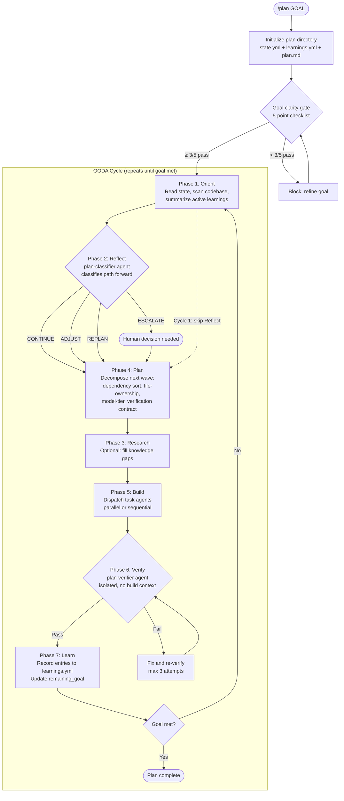
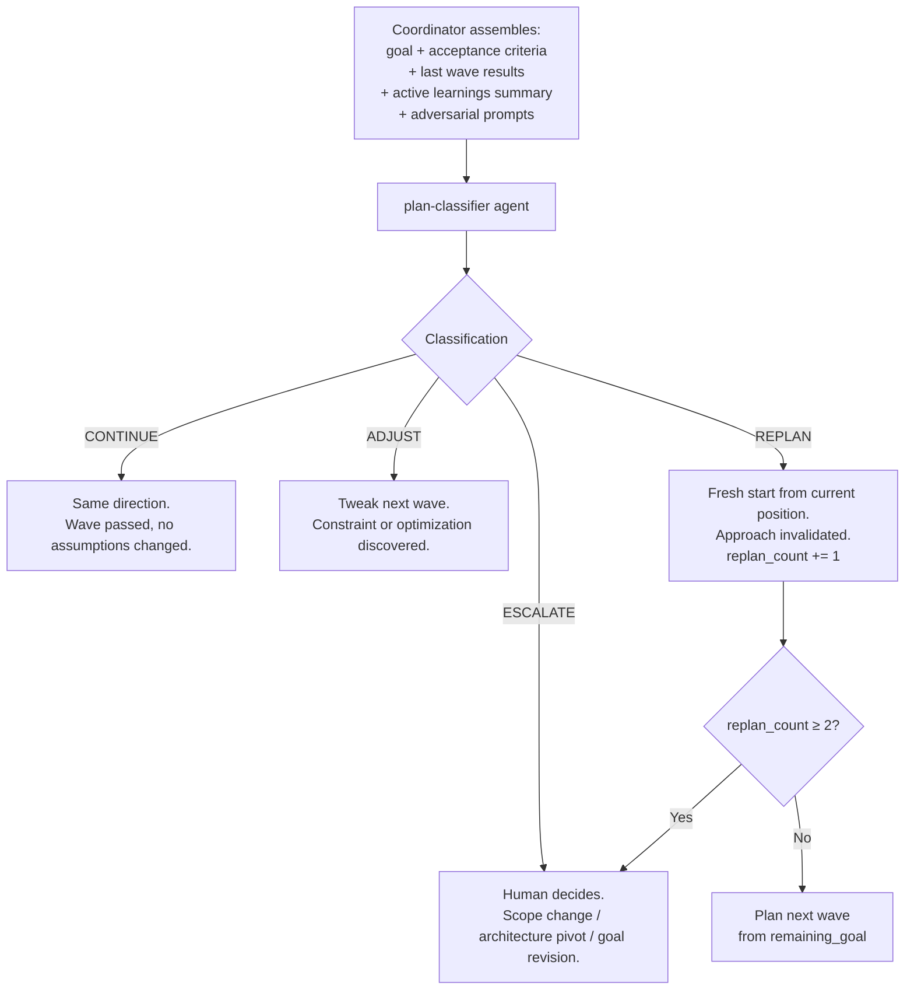

# Planning System — Deep Reference

The plan-engine is kronen's goal-driven iterative planning system. It runs an OODA loop that plans one wave at a time, executes via multi-agent dispatch, verifies with an isolated agent, and accumulates learnings across cycles. The goal is fixed at creation. The path adapts based on what's learned.

## Architecture Overview



## Components

| Component | Type | File | Purpose |
|-----------|------|------|---------|
| plan-engine | Skill | `skills/plan-engine/SKILL.md` | Main skill. OODA loop algorithm. |
| plan-verifier | Agent | `agents/plan-verifier.md` | Isolated wave verification. Zero tools. |
| plan-classifier | Agent | `agents/plan-classifier.md` | Reflect phase classification. Zero tools. |
| plan-verification-gate | Hook | `scripts/plan-verification-gate.sh` | Blocks writes to future wave files. |
| plan-recovery | Hook | `scripts/plan-recovery.sh` | Surfaces interrupted plans at session start. |
| plan-prompt-constructor | Script | `scripts/plan-prompt-constructor.sh` | Builds cycle-aware autopilot prompts. |
| /plan | Command | `commands/plan.md` | User-facing entry point. |
| /plan-status | Command | `commands/plan-status.md` | Read-only progress inspection. |

## Methods and Algorithms

### 1. Goal Clarity Gate

Runs before cycle 1. Five mechanical checks — no vibes-based judgment.

| Check | What it validates | Failure condition |
|-------|-------------------|-------------------|
| Non-empty | ≥2 acceptance criteria entries | Empty array or single entry |
| Specificity | Each criterion ≥15 characters | Too terse to be verifiable |
| No vague markers | No "works well", "is clean", "looks right", "as expected" | Generic phrases that resist verification |
| Verifiability signal | Each criterion has a file path, command ref, quantifier, or number | Aspirational, not measurable |
| Goal-criteria alignment | ≥50% of goal keywords appear in criteria | Criteria don't reference what the goal is about |

**Scoring:** 5/5 → proceed. 3-4/5 → proceed with warnings. 0-2/5 → block.

**Immutability:** After cycle 1, goal + acceptance_criteria are frozen. Changes → ESCALATE.

### 2. Wave Decomposition (Phase 4: Plan)

Three-step algorithm that converts tasks into executable waves:

**Step 1: Dependency resolution (topological sort)**
1. Build dependency graph from `depends_on` arrays
2. Find all tasks with empty/satisfied dependencies → Wave 1
3. Remove those tasks, find newly unblocked → Wave 2
4. Repeat until all tasks assigned
5. If any iteration finds zero unblocked tasks but tasks remain → cycle detected, halt

**Step 2: File-ownership conflict resolution**
For each wave, check pairwise file-ownership conflicts:

| Path A | Path B | Conflict? |
|--------|--------|-----------|
| `file.yml` | `file.yml` | Yes — same file |
| `file.yml#colors` | `file.yml#typography` | No — different sections |
| `file.yml` | `file.yml#colors` | Yes — whole-file includes section |
| `assets/*` | `assets/icons/check.svg` | Yes — glob contains path |
| `src/*.ts` | `tests/*.ts` | No — different directories |

Resolution: keep the task with more downstream dependents in the current wave, bump the other to the next wave. Tie-break by task order.

**Step 3: Model-tier assignment**

| Tier | Model | Use when |
|------|-------|----------|
| junior | Haiku | Scaffolding, config generation, templated output |
| senior | Sonnet | Implementation, content generation, reasoning (default) |
| principal | Opus | Architecture decisions, QA/verification, cross-cutting concerns |

### 3. Verification (Phase 6: Verify)

Dispatched to plan-verifier agent. Isolated — no build context.

```mermaid
flowchart LR
    COORD[Coordinator] -->|reads output files| PACKAGE[Assembles package:<br/>verification contract<br/>+ task descriptions<br/>+ file contents<br/>+ state snapshot]
    PACKAGE -->|passes to| VERIFIER[plan-verifier agent<br/>zero tools]

    subgraph STAGE1 [Stage 1: Mechanical]
        F1[File existence]
        F2[Schema presence]
        F3[Non-empty content]
        F4[File ownership]
        F5[State consistency]
    end

    subgraph STAGE2 [Stage 2: Quality]
        Q1[Content matches contract?]
        Q2[Cross-wave consistency?]
        Q3[Completeness?]
        Q4[Acceptance criteria?<br/>final wave only]
    end

    VERIFIER --> STAGE1
    STAGE1 -->|All pass| STAGE2
    STAGE1 -->|Any fail| FAIL([Fail — fix and retry])
    STAGE2 --> VERDICT{Verdict}
    VERDICT -->|pass / pass_with_warnings| OK([Continue])
    VERDICT -->|fail| FAIL
```



**Why isolated:** Confirmation bias from the build phase influences verdicts. The verifier receives content, not context. It can't read additional files or "remember" what was intended.

### 4. Classification (Phase 2: Reflect)

Dispatched to plan-classifier agent. Pure reasoning — no tools, no file access.



**Anti-oscillation:** Max 2 replans. After that, forces ESCALATE to prevent bouncing between approaches.

**Adversarial prompts** (from `references/reflect-prompts.md`) counter sunk-cost bias by asking questions like "If you were starting fresh, would you take the same approach?"

### 5. Learnings Accumulation (Phase 7: Learn)

Each cycle records typed entries to `learnings.yml`:

| Type | When | Rule |
|------|------|------|
| observation | Noticed a pattern or fact | Specific and actionable |
| constraint | Discovered a limitation | Explains what it means for future planning |
| correction | Prior learning was wrong | Must set `supersedes` field |
| discovery | New insight that opens possibilities | Explains the opportunity |

**Context management:** Orient phase loads only `status: active` entries. Superseded entries stay on disk. Summaries, not raw dumps.

**Correction chains:** Every correction must reference what it supersedes. This prevents phantom learnings — wrong observations from early cycles that persist because nothing explicitly invalidated them.

**Error-to-instinct:** Error patterns that recur across waves get promoted to constraint-type entries with systemic impact notes.

### 6. Autopilot Integration

Plans execute via autopilot by default. The `plan-prompt-constructor.sh` script builds cycle-aware prompts:

1. Reads `state.yml` — plan name, cycle, remaining_goal, replan_count, max_cycles
2. Reads `learnings.yml` — active count, open questions, next_orientation
3. Outputs a self-contained prompt with 7-step OODA instructions
4. If plan status is `done` → empty output (autopilot terminates)
5. If max_cycles reached → escalation message instead of continuation

### 7. Hook Protection

**plan-verification-gate (PreToolUse, blocking)**
- Fires on every Write/Edit
- Finds active plan from `state.yml`
- Checks if target file belongs to a future wave via `plan.yml`
- Blocks writes to future wave files before current wave verification passes
- Fail-open: errors allow the write

**plan-recovery (SessionStart, informational)**
- Scans all `state.yml` files for `status: in_progress`
- Surfaces active plans with cycle number and remaining_goal
- Never modifies state — informational only

## Execution Flow in Detail

### Cycle 1 (initialization)

```
User runs: /plan "Add rate limiting to all API endpoints"
  │
  ├── Parse goal, derive plan name
  ├── Create .ai/plans/rate-limiting/
  ├── Initialize state.yml, learnings.yml, plan.md
  ├── Run goal clarity gate (5 checks)
  │     ├── Non-empty: 3 criteria → PASS
  │     ├── Specificity: all > 15 chars → PASS
  │     ├── Vague markers: none found → PASS
  │     ├── Verifiability: "429 status", "< 5ms" → PASS
  │     └── Alignment: "rate limiting" in criteria → PASS
  │     Score: 5/5 → proceed
  │
  ├── Orient: scan codebase for current API structure
  ├── Skip Reflect (cycle 1)
  ├── Plan wave 1: implement rate limiter + configure per endpoint
  ├── Build: dispatch 2 task agents
  ├── Verify: plan-verifier checks against contract
  └── Learn: record observations, increment cycle
```

### Cycle 2+ (iterative)

```
  ├── Orient: load active learnings, assess remaining_goal
  ├── Reflect: dispatch plan-classifier
  │     ├── CONTINUE → plan next wave normally
  │     ├── ADJUST → modify approach for next wave
  │     ├── REPLAN → discard future plans, replan from current position
  │     └── ESCALATE → pause for human input
  │
  ├── Research (optional): fill knowledge gaps
  ├── Plan: decompose next wave with file-ownership isolation
  ├── Build: dispatch agents
  ├── Verify: isolated plan-verifier
  └── Learn: update learnings, check if goal met
```

## File Structure

```
.ai/plans/{plan-name}/
  state.yml              # Execution state: cycle, goal, acceptance_criteria,
                         #   remaining_goal, planned_waves, errors
  learnings.yml          # Episodic memory: typed entries, open_questions,
                         #   cycle_metrics, next_orientation
  plan.yml               # Wave structure: tasks, dependencies, file-ownership,
                         #   verification contracts
  plan.md                # Implementation contract: standards, constraints
  artifacts/             # Agent output files per wave
    wave-1-t1-output.md
    wave-1-t1-concerns.md
```

## Safety Mechanisms Summary

| Mechanism | What it prevents | Trigger |
|-----------|-----------------|---------|
| Goal clarity gate | Vague goals wasting cycles | Pre-cycle-1, 5 mechanical checks |
| Goal immutability | Goal drift during execution | After cycle 1, any change → ESCALATE |
| Max replans (2) | Approach oscillation | replan_count ≥ 2 → force ESCALATE |
| Max cycles (15) | Infinite loops | Cycle counter → ESCALATE |
| Verification isolation | Confirmation bias | Separate agent, zero tools, no build context |
| Verification contracts | Post-hoc rationalization | Written at Plan time, before Build |
| File-ownership | Write conflicts in parallel waves | Pairwise check at Plan time |
| plan-verification-gate | Premature wave advancement | PreToolUse hook blocks future-wave writes |
| Completed wave protection | Sunk cost of rebuilding | REPLAN only affects future waves |

## Related Documents

- `plugins/kronen/skills/plan-engine/SKILL.md` — skill metadata and 7-phase summary
- `plugins/kronen/skills/plan-engine/references/process.md` — full algorithm (750+ lines)
- `plugins/kronen/skills/plan-engine/references/reflect-prompts.md` — adversarial templates
- `plugins/kronen/resources/plan-schema.yml` — wave structure schema
- `plugins/kronen/resources/state-schema.yml` — execution state schema
- `plugins/kronen/resources/learnings-schema.yml` — episodic memory schema
- `.ai/brainstorm/planning-consolidation/decisions.yml` — design decisions (PC-D01 through PC-D14)
