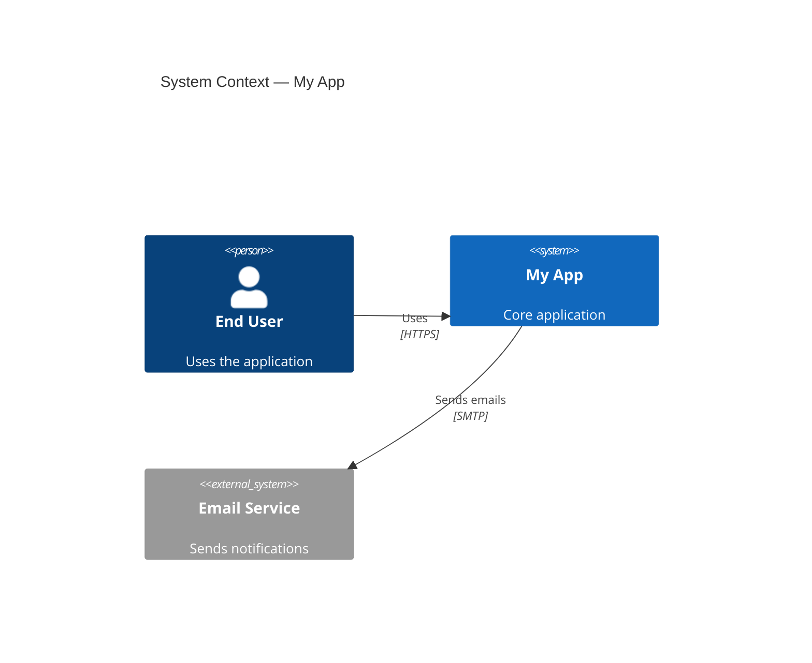

# c4-architecture

Generate architecture documentation using the C4 model with Mermaid diagrams. The C4 model (Context, Containers, Components, Code) provides four hierarchical levels of abstraction for communicating software architecture to different audiences.

## Workflow

1. **Understand scope** -- Identify the system, its users, and external dependencies
2. **Analyze codebase** -- Read project structure, configs, and entry points to map boundaries
3. **Select levels** -- Pick diagram levels appropriate for the audience (see table below)
4. **Generate diagrams** -- Produce Mermaid C4 diagrams with valid syntax
5. **Document** -- Write output to `docs/architecture/` with narrative context per diagram

## Level selection

| Level | Diagram type | Audience | Shows |
|-------|-------------|----------|-------|
| 1 | System Context | Everyone | System + users + external systems |
| 2 | Container | Dev team + ops | Applications, databases, APIs within the system |
| 3 | Component | Developers | Internal modules/services within a container |
| 4 | Deployment | Ops + infra | Infrastructure nodes and container placement |
| -- | Dynamic | Anyone | Request flows through the system over time |

Context + Container (levels 1-2) are sufficient for most teams. Only go deeper when the audience needs it.

## Quick start -- System Context

````markdown

````

## Output convention

Write all architecture docs to `docs/architecture/`:
- `system-context.md` -- Level 1 diagram + narrative
- `containers.md` -- Level 2 diagram + narrative
- `components-<name>.md` -- Level 3 per container (only when needed)
- `deployment.md` -- Infrastructure mapping
- `dynamic-<flow>.md` -- Key request flows

## Best practices

- Start at Context level and zoom in only as needed
- Label all relationships with protocol/technology
- Use `_Ext` variants for anything outside your system boundary
- Keep each diagram focused -- split large systems into multiple diagrams
- Add narrative paragraphs explaining *why* the architecture looks this way

Full Mermaid C4 syntax reference: `references/c4-syntax.md`
