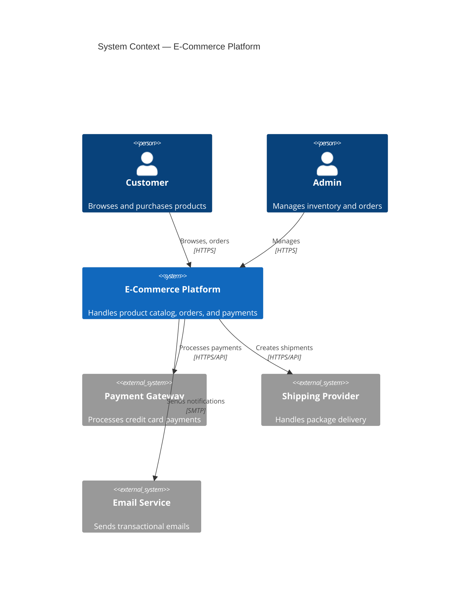
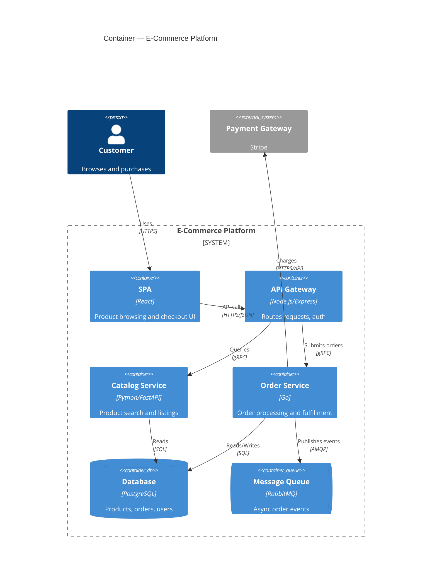
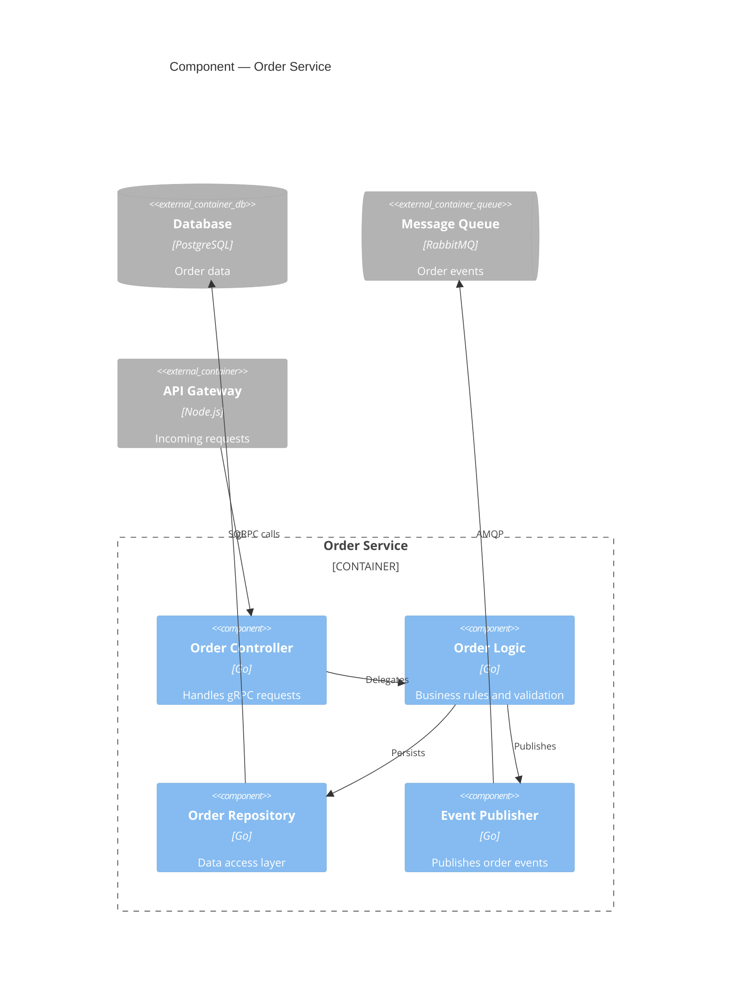
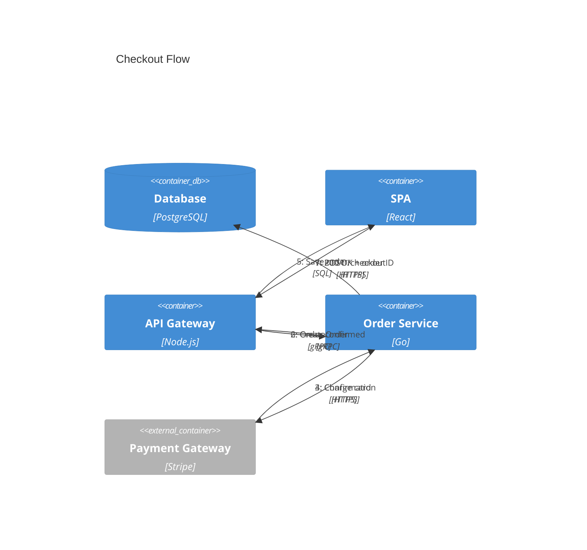
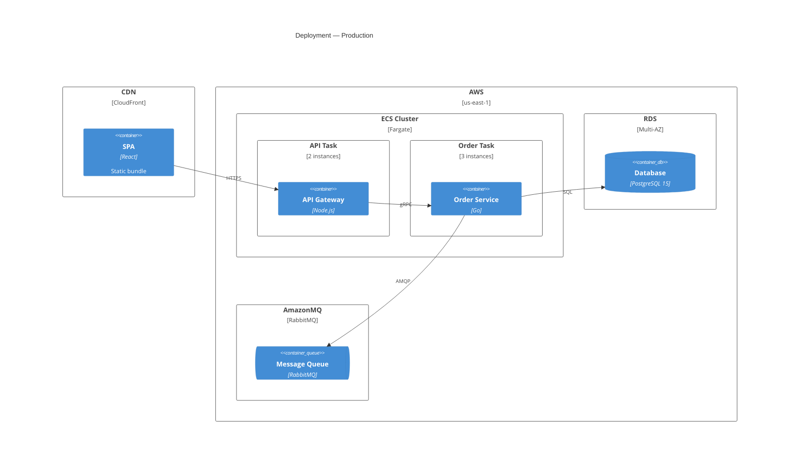

# C4 Mermaid Syntax Reference

Complete syntax reference for C4 architecture diagrams in Mermaid.

## Diagram types

Five diagram types are available:

```
C4Context      -- Level 1: System Context
C4Container    -- Level 2: Container
C4Component    -- Level 3: Component
C4Deployment   -- Level 4: Deployment
C4Dynamic      -- Dynamic: sequenced interactions
```

---

## Element syntax

### People

```
Person(alias, "Label", "Description")
Person_Ext(alias, "Label", "Description")
```

### Systems

```
System(alias, "Label", "Description")
System_Ext(alias, "Label", "Description")
System_Db(alias, "Label", "Description")
System_Db_Ext(alias, "Label", "Description")
System_Queue(alias, "Label", "Description")
System_Queue_Ext(alias, "Label", "Description")
```

### Containers

```
Container(alias, "Label", "Technology", "Description")
Container_Ext(alias, "Label", "Technology", "Description")
ContainerDb(alias, "Label", "Technology", "Description")
ContainerDb_Ext(alias, "Label", "Technology", "Description")
ContainerQueue(alias, "Label", "Technology", "Description")
ContainerQueue_Ext(alias, "Label", "Technology", "Description")
```

### Components

```
Component(alias, "Label", "Technology", "Description")
Component_Ext(alias, "Label", "Technology", "Description")
ComponentDb(alias, "Label", "Technology", "Description")
ComponentQueue(alias, "Label", "Technology", "Description")
```

---

## Boundary syntax

Boundaries group elements visually. They can be nested.

```
Boundary(alias, "Label") {
    <elements>
}

Enterprise_Boundary(alias, "Label") {
    <elements>
}

System_Boundary(alias, "Label") {
    <elements>
}

Container_Boundary(alias, "Label") {
    <elements>
}
```

### Deployment boundaries

```
Deployment_Node(alias, "Label", "Technology", "Description") {
    <elements or nested nodes>
}

Deployment_Node_R(alias, "Label", "Technology", "Description", $instances) {
    <elements>
}
```

The `_R` variant accepts an instance count.

---

## Relationship syntax

### Basic relationships

```
Rel(from, to, "Label")
Rel(from, to, "Label", "Technology")
Rel(from, to, "Label", "Technology", "Description")
```

### Directional relationships

```
Rel_D(from, to, "Label")      -- Down
Rel_U(from, to, "Label")      -- Up
Rel_L(from, to, "Label")      -- Left
Rel_R(from, to, "Label")      -- Right
```

Long form aliases also work: `Rel_Down`, `Rel_Up`, `Rel_Left`, `Rel_Right`.

### Bidirectional

```
BiRel(from, to, "Label")
BiRel(from, to, "Label", "Technology")
```

### Indexed relationships (Dynamic diagrams)

In `C4Dynamic` diagrams, relationships are automatically numbered in order of appearance. Use `Rel` as normal -- Mermaid adds the sequence index.

---

## Styling and layout

### Update element style

```
UpdateElementStyle(alias, $bgColor="color", $fontColor="color", $borderColor="color")
```

### Update relationship style

```
UpdateRelStyle(from, to, $textColor="color", $lineColor="color", $offsetX="n", $offsetY="n")
```

### Layout direction

```
UpdateLayoutConfig($c4ShapeInRow="3", $c4BoundaryInRow="1")
```

- `$c4ShapeInRow` -- max elements per row inside a boundary
- `$c4BoundaryInRow` -- max boundaries per row

---

## Example: System Context (Level 1)



## Example: Container (Level 2)



## Example: Component (Level 3)



## Example: Dynamic diagram



## Example: Deployment (Level 4)



---

## Microservices guidelines

### Single team ownership

When one team owns the full system, a single Container diagram usually suffices. Show all services, databases, and queues in one boundary. Zoom into Component level only for the most complex service.

### Multi-team ownership

When multiple teams own different services:
- Create one System Context showing the full landscape
- Create one Container diagram per team's domain boundary
- Use `_Ext` variants for services owned by other teams
- Each team maintains their own Component diagrams

### Event-driven architectures

- Show message queues/brokers as `ContainerQueue` elements
- Use Dynamic diagrams to show event flows (pub/sub sequences)
- Label relationships with event names, not just protocols
- Consider separate Dynamic diagrams for each major event flow

---

## Common mistakes and anti-patterns

### Wrong level of detail

- Showing classes/functions in a Container diagram (too detailed)
- Showing infrastructure in a System Context diagram (wrong audience)
- Mixing abstraction levels in a single diagram

### Missing context

- Omitting external systems that the software depends on
- Not showing users/personas who interact with the system
- Leaving relationships unlabeled (no protocol or purpose)

### Diagram overload

- Cramming 20+ elements into a single diagram -- split into multiple
- Showing every microservice in a Context diagram -- aggregate into one System box
- Including deployment details in Component diagrams

### Syntax pitfalls

- Using `Container` in a `C4Context` diagram (wrong level -- use `System`)
- Forgetting quotes around labels with special characters
- Using `Rel` without specifying `from` and `to` aliases that exist in the diagram
- Nesting boundaries deeper than 2 levels (renders poorly in most tools)

### Staleness

- Architecture diagrams that aren't updated when the system changes
- Keep diagrams in version control alongside the code they describe
- Prefer fewer, accurate diagrams over comprehensive but stale ones
