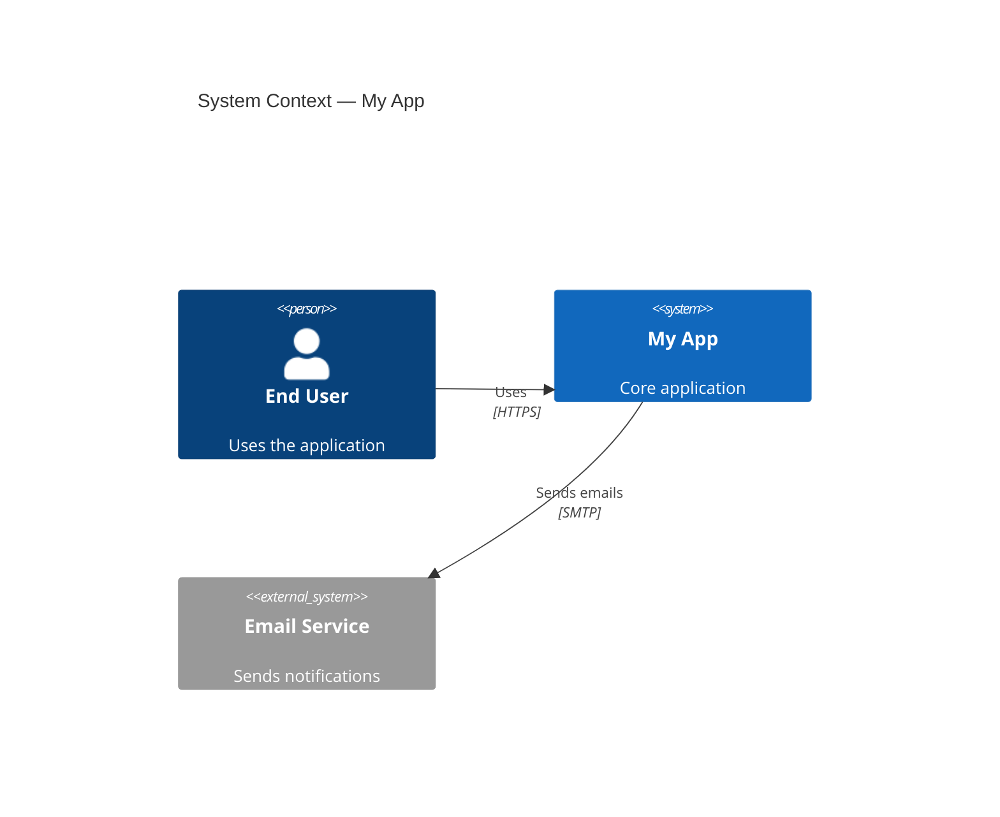

# C4 Architecture — Process Reference

## Quick Start -- System Context

````markdown

````

## Output Convention

Write all architecture docs to `docs/architecture/`:
- `system-context.md` -- Level 1 diagram + narrative
- `containers.md` -- Level 2 diagram + narrative
- `components-<name>.md` -- Level 3 per container (only when needed)
- `deployment.md` -- Infrastructure mapping
- `dynamic-<flow>.md` -- Key request flows

## Best Practices

- Start at Context level and zoom in only as needed
- Label all relationships with protocol/technology
- Use `_Ext` variants for anything outside your system boundary
- Keep each diagram focused -- split large systems into multiple diagrams
- Add narrative paragraphs explaining *why* the architecture looks this way
