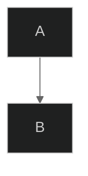
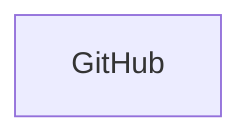

# Advanced Mermaid Features

Configuration, styling, theming, layout, and export options.

## Frontmatter Configuration



## Themes

| Theme | Description |
|-------|-------------|
| `default` | Standard blue |
| `forest` | Green earth tones |
| `dark` | Dark mode |
| `neutral` | Grayscale professional |
| `base` | Minimal, best for customization |

## Theme Variables

Key variables for `base` theme customization:

```yaml
themeVariables:
  primaryColor: "#ff6b6b"
  primaryTextColor: "#fff"
  primaryBorderColor: "#d63031"
  lineColor: "#74b9ff"
  secondaryColor: "#00b894"
  tertiaryColor: "#fdcb6e"
  background: "#f0f0f0"
  mainBkg: "#ffffff"
  textColor: "#333333"
  nodeBorder: "#333333"
  clusterBkg: "#f9f9f9"
  clusterBorder: "#666666"
```

## Layout Options

**Dagre (default):** Classic balanced layout. Good for most diagrams.

**ELK (advanced):** Better automatic layout for complex diagrams with >20 nodes.

```yaml
config:
  layout: elk
  elk:
    mergeEdges: true
    nodePlacementStrategy: BRANDES_KOEPF
```

ELK strategies: `SIMPLE`, `NETWORK_SIMPLEX`, `LINEAR_SEGMENTS`, `BRANDES_KOEPF`

## Look Options

- `look: classic` — traditional Mermaid style
- `look: handDrawn` — sketch-like informal appearance

## Styling

**Class-based:**


**Node-specific:** `style A fill:#ff6b6b,stroke:#333,stroke-width:4px`

**Link-specific:** `linkStyle 0 stroke:#ff3,stroke-width:4px`

**Subgraph styling:** `style SubgraphName fill:#e3f2fd,stroke:#2196f3`

## Click Events and Links



## Export

```bash
# SVG with dimensions
mmdc -i diagram.mmd -o output.svg -w 1920 -H 1080

# PNG with background
mmdc -i diagram.mmd -o output.png -b "#ffffff"

# Transparent background
mmdc -i diagram.mmd -o output.svg -b "transparent"
```

Install CLI: `npm install -g @mermaid-js/mermaid-cli`

## Rendering Support

Native: GitHub, GitLab, VS Code (Markdown Mermaid extension), Notion, Obsidian, Confluence
Online: mermaid.live (editor with PNG/SVG export)

## Accessibility

- Use high contrast color combinations
- Don't rely solely on color to convey meaning
- Include descriptive text labels
- Test with color blindness simulators

## Tips

1. Pick one theme for related diagrams
2. Don't over-style — too many colors reduce clarity
3. Use ELK for complex diagrams with crossed lines
4. Test hand-drawn look — some diagrams work better with classic
5. Split very large diagrams (>20 nodes) into focused views
6. Enable edge merging for simplified connections in ELK
