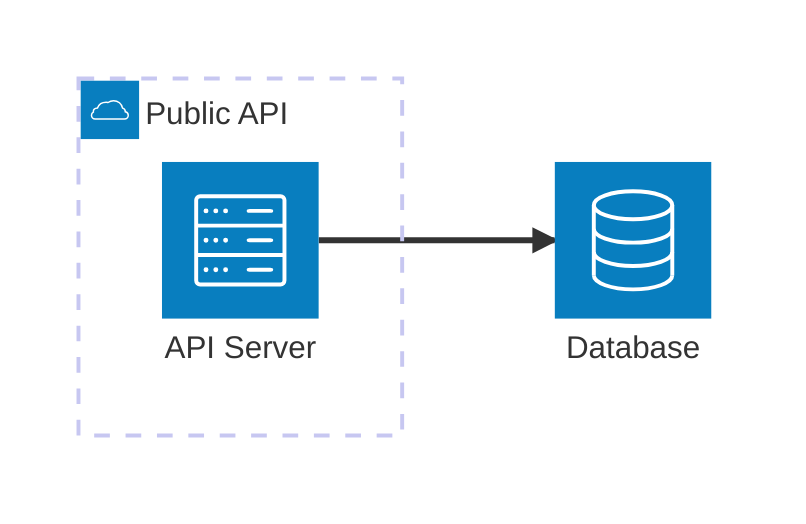
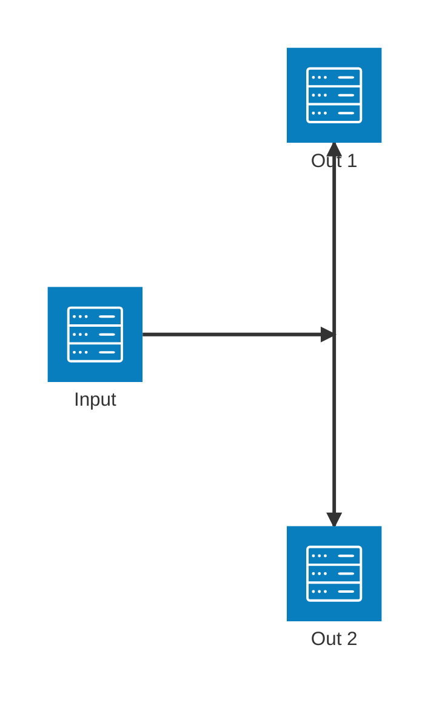

# Architecture Diagrams

Visualize cloud services, CI/CD deployments, and infrastructure. Uses `architecture-beta` syntax (Mermaid v11.1.0+).

## Basic Syntax



## Groups

```
group {id}({icon})[{title}] (in {parentId})?
```

Groups can be nested. Use to represent environments, layers, or boundaries.

## Services

```
service {id}({icon})[{title}] (in {parentId})?
```

## Edges

```
{serviceId}{group}?:{T|B|L|R} {<}?--{>}? {T|B|L|R}:{serviceId}{group}?
```

Directions: `T` (top), `B` (bottom), `L` (left), `R` (right)
Arrows: `<` incoming, `>` outgoing

| Pattern | Description |
|---------|-------------|
| `A:R -- L:B` | Horizontal edge |
| `A:T -- B:B` | Vertical edge |
| `A:R --> L:B` | Directed edge |
| `A:R <--> L:B` | Bidirectional |
| `A{group}:R --> L:B` | Edge from group boundary |

## Junctions

4-way split points:



## Icons

**Default:** `cloud`, `database`, `disk`, `internet`, `server`

**Custom (iconify.design):** 200,000+ icons available.

```mermaid
architecture-beta
    service web(logos:docker)[Docker]
    service k8s(logos:kubernetes)[K8s]
```



Popular icon packs: `@iconify-json/logos` (tech brands), `@iconify-json/mdi` (Material Design), `@iconify-json/simple-icons`

Install: `npm install @iconify-json/logos @mermaid-js/mermaid-cli`
Render: `mmdc --iconPacks @iconify-json/logos -i diagram.mmd -o output.svg`

## Group Edges

Connect at group boundary level:

```mermaid
architecture-beta
    group frontend(cloud)[Frontend]
    group backend(cloud)[Backend]
    service client(browser)[Client] in frontend
    service api(server)[API] in backend

    client{group}:B --> T:api{group}
```



## Tips

1. Group services by environment (public/private) or layer
2. Use consistent icons for service types
3. Label edges with protocols when relevant
4. Use junctions for fan-out patterns
5. Split complex architectures into multiple views
