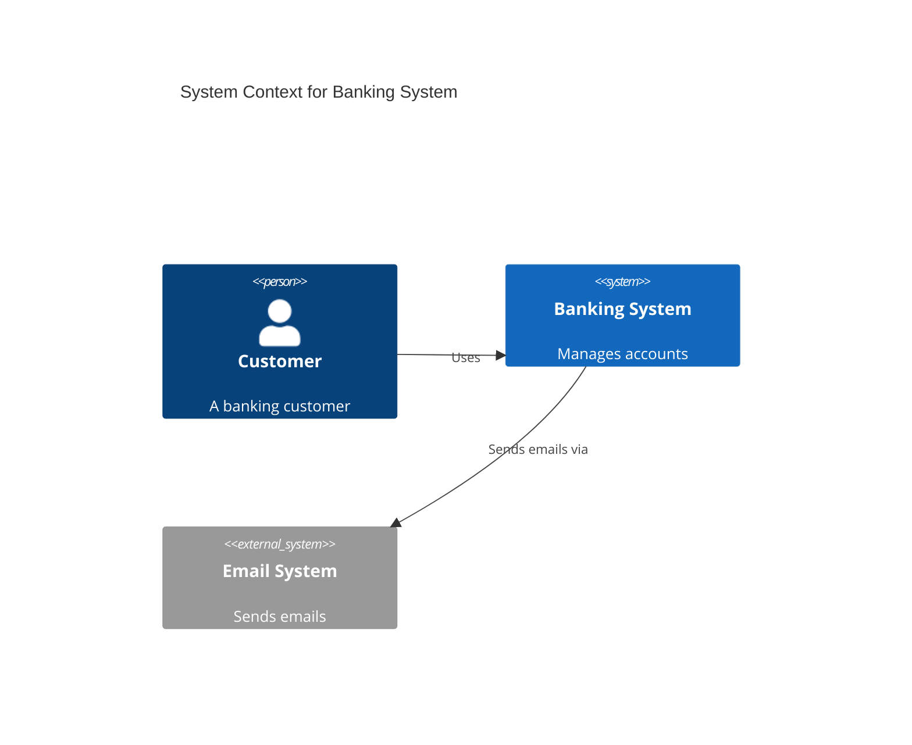
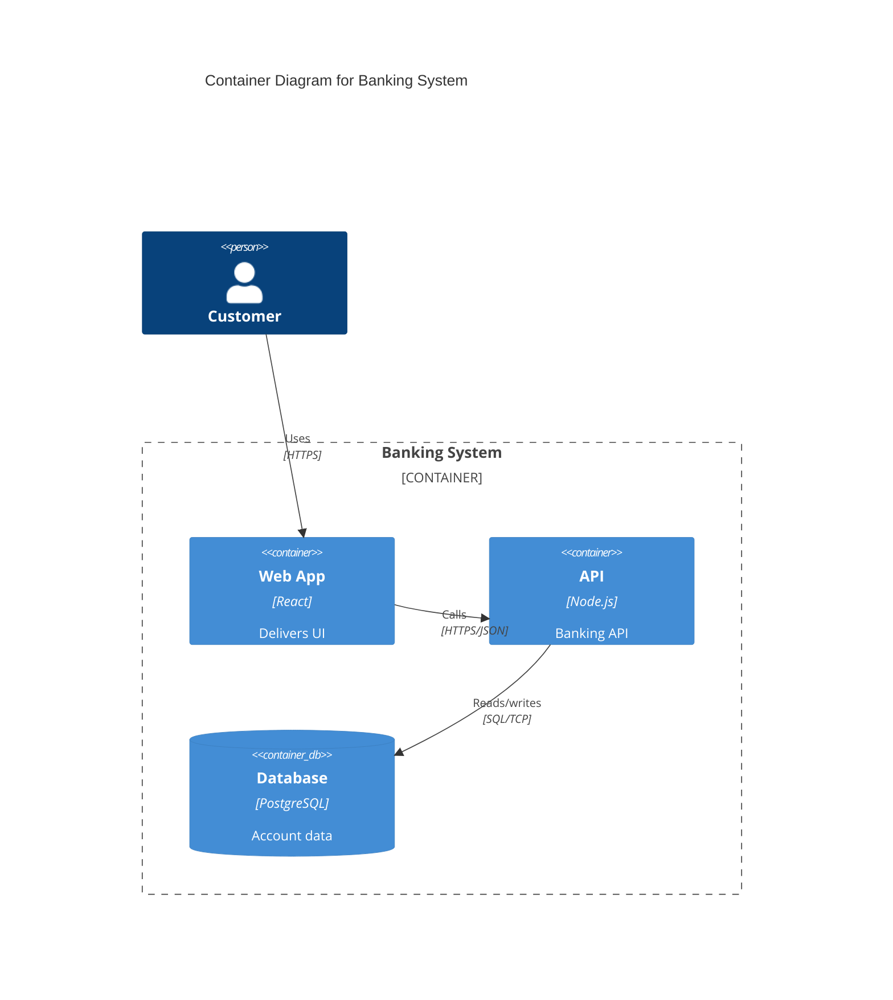
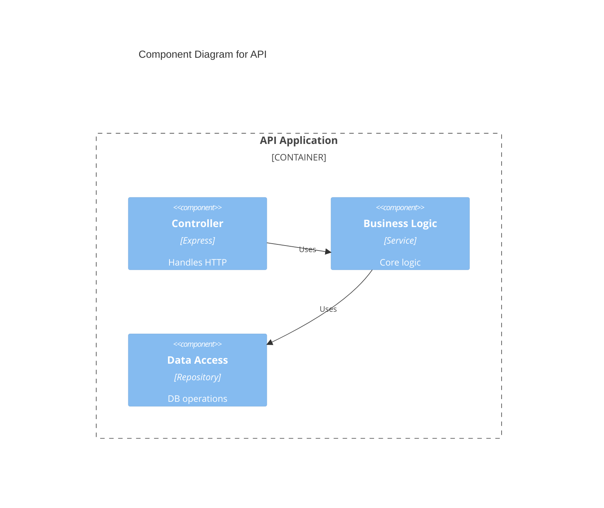

# C4 Model Diagrams

Hierarchical software architecture visualization at four levels of abstraction.

## C4 Levels

1. **System Context** — system + users + external systems (stakeholder audience)
2. **Container** — applications, databases, services within the system (architect audience)
3. **Component** — internal structure of containers (developer audience)
4. **Code** — class diagrams for implementation detail (use `classDiagram`)

## C4 Context Diagram



**Elements:**
- `Person(id, "Name", "Description")` / `Person_Ext()`
- `System(id, "Name", "Description")` / `System_Ext()`
- `SystemDb()` / `SystemDb_Ext()` — database systems
- `SystemQueue()` / `SystemQueue_Ext()` — message queues
- `Rel(from, to, "Label", "Technology")` / `BiRel()`

## C4 Container Diagram



**Elements:**
- `Container(id, "Name", "Technology", "Description")` / `Container_Ext()`
- `ContainerDb()` — database containers
- `ContainerQueue()` — message queue containers
- `Container_Boundary(id, "Label") { ... }` — grouping

## C4 Component Diagram



## Styling

```
UpdateRelStyle(from, to, $offsetX="-50", $offsetY="-30")
```

## Architecture Patterns

**Monolithic:** Single `Container` + `ContainerDb` + `ContainerDb` (cache)
**Three-tier:** Presentation → Business → Data boundaries
**Microservices:** Multiple containers per boundary, `ContainerQueue` for async
**Event-driven:** Services publish/consume via `ContainerQueue`

## Tips

1. Use appropriate level for your audience
2. One system per Context, one container per Component
3. Show key relationships — don't clutter
4. Consistent naming across all levels
5. Include technology details at Container/Component level
6. Use `*_Ext` variants for external systems
7. Start with Context, drill down as needed
