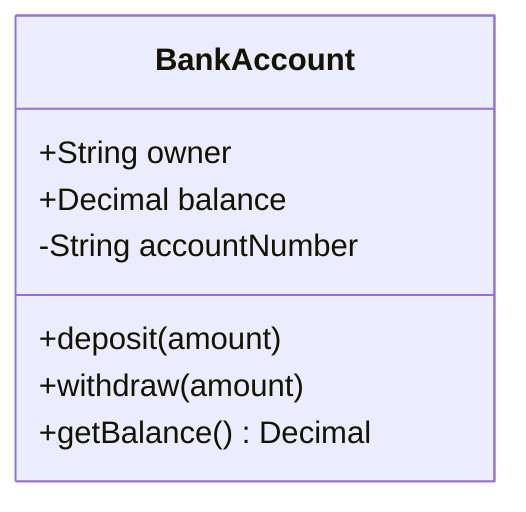
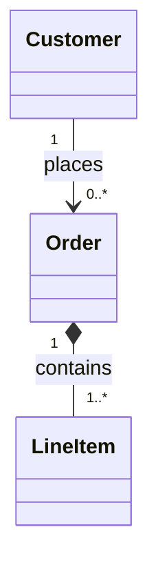
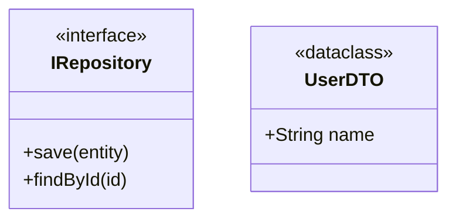
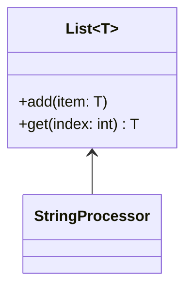

# Class Diagrams

Model object-oriented designs and domain models. Show entities, attributes/methods, and relationships.

## Basic Syntax

**Visibility:** `+` Public, `-` Private, `#` Protected, `~` Package/Internal

## Relationships

| Syntax | Type | Meaning |
|--------|------|---------|
| `A -- B` | Association | Loose relationship, exist independently |
| `A *-- B` | Composition | Strong ownership, child deleted with parent |
| `A o-- B` | Aggregation | Weak ownership, child exists independently |
| `A <\|-- B` | Inheritance | "Is-a" relationship |
| `A <.. B` | Dependency | Uses as parameter or local variable |
| `A <\|.. B` | Realization | Implements an interface |

## Multiplicity

Values: `1`, `0..1`, `0..*` or `*`, `1..*`, `m..n`

## Stereotypes

Common: `<<interface>>`, `<<abstract>>`, `<<service>>`, `<<dataclass>>`, `<<enumeration>>`, `<<entity>>`, `<<value object>>`, `<<aggregate root>>`

## Generics

## DDD Patterns

**Entity:** Has identity (`-UUID id`), stereotype `<<entity>>`
**Value Object:** Immutable, no identity, stereotype `<<value object>>`
**Aggregate Root:** Entry point to aggregate, stereotype `<<aggregate root>>`

## Design Patterns

**Repository:** `IRepository~T~` interface with `save`, `findById`, `delete`
**Factory:** `Factory ..> Product : creates`
**Strategy:** Interface with multiple implementations, context holds reference

## Tips

1. Start with core entities, add detail incrementally
2. Omit obvious getters/setters
3. Choose relationship types carefully (association vs composition vs aggregation)
4. Add multiplicity to clarify cardinality
5. Use notes for business rules and invariants
