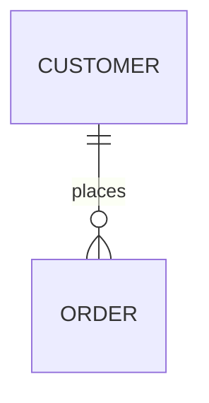
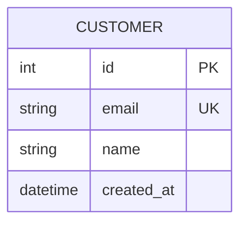
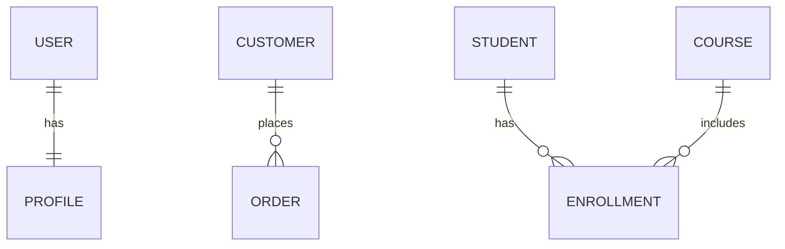
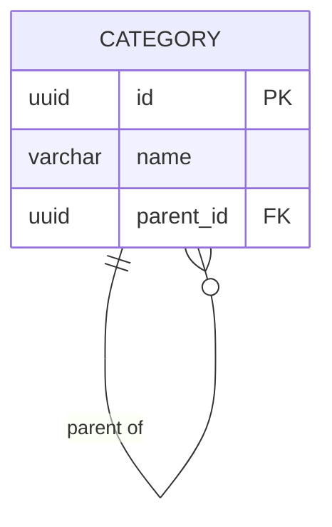
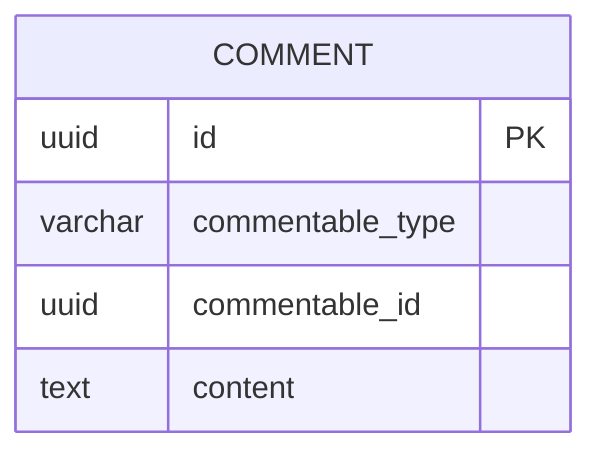

# Entity Relationship Diagrams (ERD)

Model database schemas: tables, columns, and relationships.

## Basic Syntax



## Entity Attributes



Format: `type name constraints`

Constraints: `PK` (Primary Key), `FK` (Foreign Key), `UK` (Unique Key), `NN` (Not Null)

## Relationship Symbols

**Cardinality:**
| Symbol | Meaning |
|--------|---------|
| `\|\|` | Exactly one |
| `\|o` | Zero or one |
| `}{` | One or many |
| `}o` | Zero or many |

**Line type:** `--` non-identifying, `..` identifying

## Common Relationships



## Data Types

Standard: `int`, `bigint`, `varchar`, `text`, `decimal`, `float`, `boolean`, `date`, `datetime`, `timestamp`, `json`, `uuid`, `blob`

## Common Patterns

**Self-referencing (hierarchical):**


**Junction table (many-to-many):**
```mermaid
erDiagram
    STUDENT ||--o{ ENROLLMENT : has
    COURSE ||--o{ ENROLLMENT : includes
    ENROLLMENT {
        uuid student_id FK PK
        uuid course_id FK PK
        date enrolled_date
    }
```

**Polymorphic:**


**Soft deletes:** Add `timestamp deleted_at "NULLABLE"` column

**Audit trail:** Version table with `version_number`, `modified_by`, `created_at`

## Tips

1. Entity names in UPPERCASE, singular (`USER` not `USERS`)
2. Define all constraints (PK, FK, UK, NOT NULL)
3. Show cardinality accurately
4. Include `created_at`/`updated_at` timestamps
5. Document computed columns
6. Use junction tables for many-to-many explicitly
7. Plan for soft deletes where appropriate
