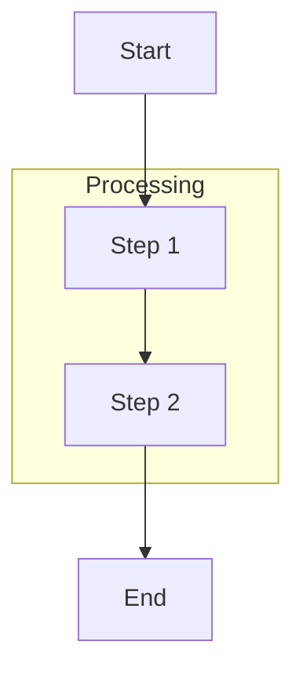
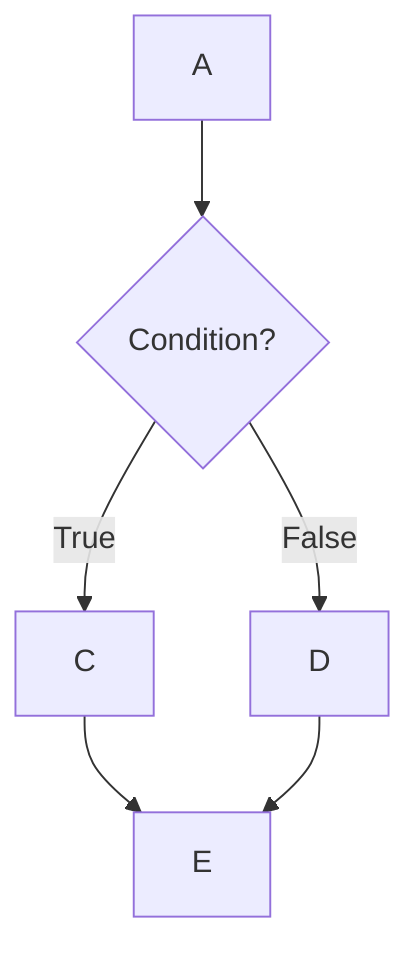

# Flowcharts

Visualize processes, algorithms, decision trees, and user journeys.

## Direction

`flowchart TD` (top-down), `TB` (top-bottom), `BT`, `LR` (left-right), `RL`

## Node Shapes

| Syntax | Shape | Use for |
|--------|-------|---------|
| `A[Text]` | Rectangle | Process steps |
| `A([Text])` | Rounded | Start/end points |
| `A(Text)` | Stadium/pill | Alternative start/end |
| `A[[Text]]` | Double border | Subroutines |
| `A[(Text)]` | Cylinder | Databases |
| `A((Text))` | Circle | Connectors |
| `A{Text}` | Diamond | Decisions |
| `A{{Text}}` | Hexagon | Preparation |
| `A[/Text/]` | Parallelogram | Input/Output |

## Connections

| Syntax | Type |
|--------|------|
| `A --> B` | Arrow |
| `A --- B` | Open link (no arrow) |
| `A -->\|Label\| B` | Labeled arrow |
| `A -.-> B` | Dotted arrow |
| `A ==> B` | Thick arrow |
| `A --> B --> C` | Chain |
| `A --> B & C` | Multi-target |

## Subgraphs



Subgraphs can be nested. Use `direction` inside subgraph to control internal layout.

## Styling

**Class-based:**


**Node-specific:**
```
style A fill:#ff6b6b,stroke:#333,stroke-width:4px
```

**Link-specific:**
```
linkStyle 0 stroke:#ff3,stroke-width:4px
```

## Common Patterns

**Linear:** `A --> B --> C --> D`

**Branch-merge:**


**Loop:** `B --> C{Continue?}` → `C -->|Yes| B`

**Error handling:** Try → decision → retry loop or abort

## Tips

1. Use meaningful, action-oriented labels
2. Consistent shapes for same action types
3. Diamonds for decisions (standard convention)
4. Flow top-down or left-right (natural reading)
5. Stadium shapes for start/end markers
6. Subgraphs for logical groupings
7. Color-code different action types sparingly
