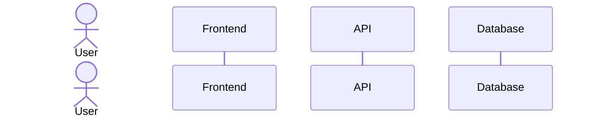
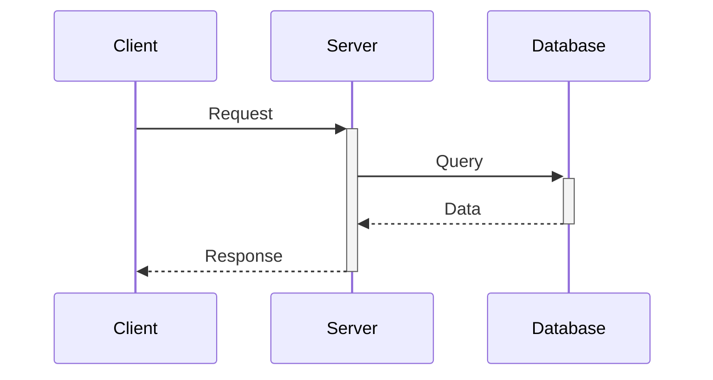
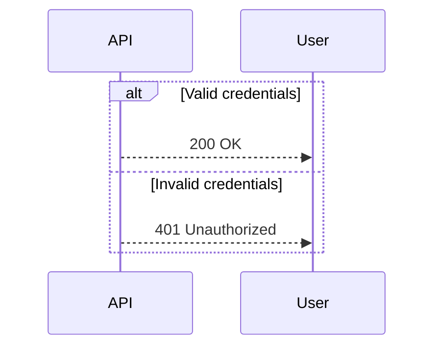
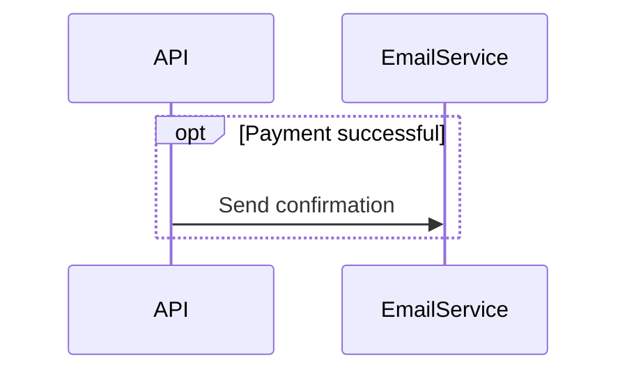
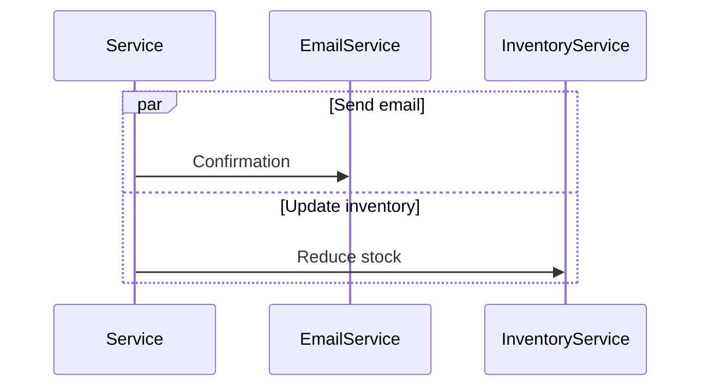
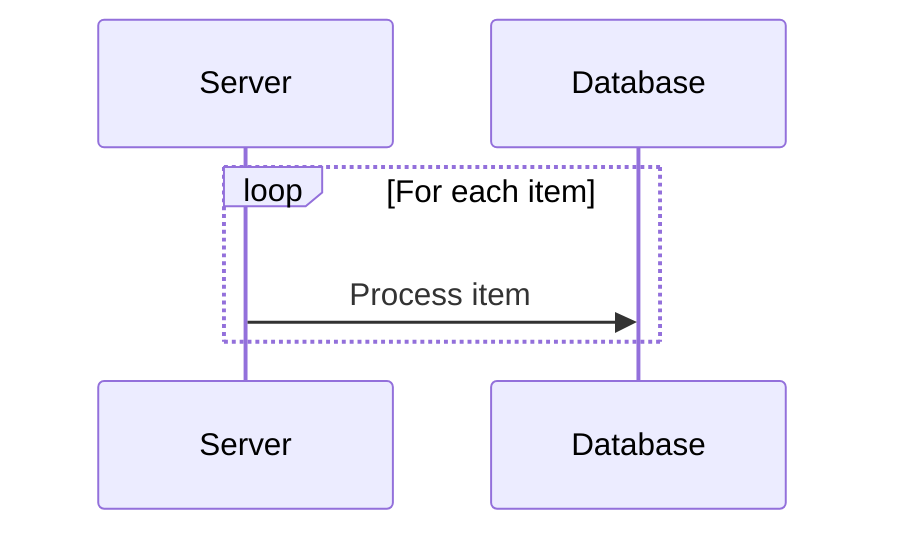
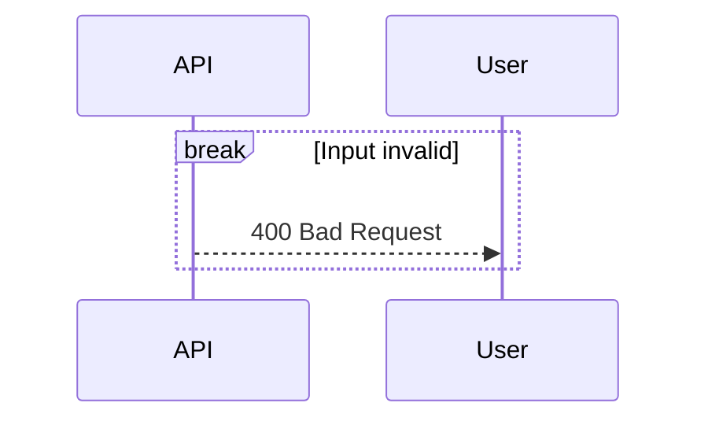
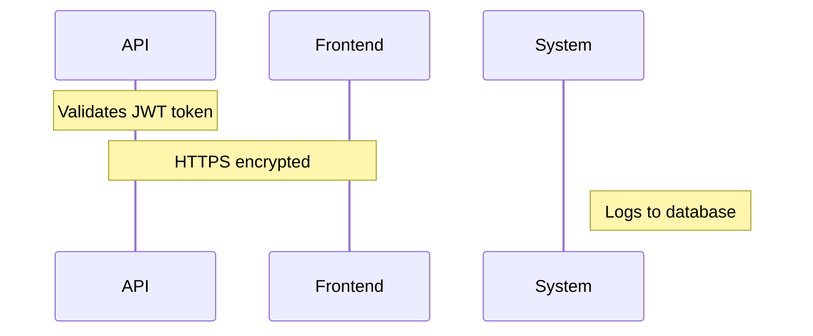
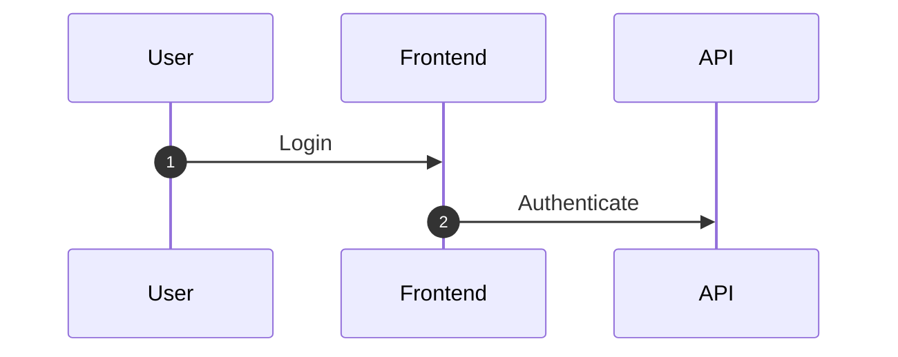
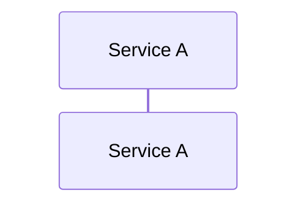

# Sequence Diagrams

Show interactions between participants over time. Ideal for API flows, auth sequences, and component interactions.

## Participants

- `participant` — system components (services, classes, databases)
- `actor` — external entities (users, external systems)

## Message Types

| Syntax | Type |
|--------|------|
| `->>` | Solid arrow (synchronous request) |
| `-->>` | Dotted arrow (response/return) |
| `-)` | Open arrow (async message) |
| `--)` | Dotted open arrow (async response) |
| `-x` | Cross (delete/failure) |

## Activations

Show active processing with `+` (activate) and `-` (deactivate):

## Control Flow Blocks

**Alt/Else (conditional):**

**Opt (optional):**

**Par (parallel):**

**Loop:**

**Break (early exit):**

## Notes

## Autonumber

## Links

## Tips

1. Order participants logically: User → Frontend → Backend → Database
2. Use activations to show processing duration
3. Group related logic with alt/opt/par
4. Use autonumber for complex flows
5. Show error paths with alt/else
6. One scenario per diagram — keep focused
