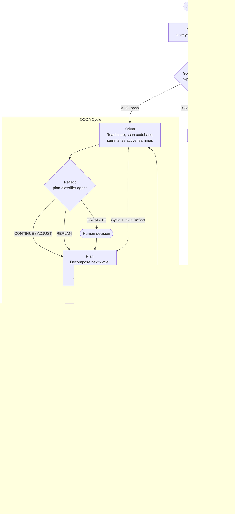

Most planning systems are task lists with extra steps. You write down what needs to happen, you check things off, and you hope the original list was right. When it isn't — when step 3 reveals that step 5 is impossible — you either hack around it or start over.

I built a planning engine for Claude Code that works differently. The goal is fixed. The path adapts. Each cycle plans one wave of work, executes it, verifies the results with an isolated agent, records what was learned, and uses those learnings to plan the next wave. The system doesn't know the full plan upfront. It discovers it.

This post is about how that works, why certain design decisions exist, and where the sharp edges are.

Here's the full loop as a diagram before we dig into the details:



## The goal is the only constant

Every plan starts with a goal statement and acceptance criteria. The goal never changes after creation — it's the fixed north star. Everything else (wave structure, task decomposition, approach) can change based on what the system learns during execution.

This distinction matters. A task-driven plan says "do these 12 things." A goal-driven plan says "achieve this outcome" and figures out the steps one wave at a time. When wave 1 reveals that your approach is wrong, a task-driven plan keeps executing the wrong steps. A goal-driven plan replans from the current position toward the same goal.

The acceptance criteria are what make "achieve this outcome" concrete. They're the verifiable conditions that define done:

```yaml
goal: "Consolidate 14 planning components into 8"
acceptance_criteria:
  - "skill-reviewer passes plan-engine with zero criticals"
  - "agent-reviewer passes both agents with zero criticals"
  - "A/B trigger testing confirms 10/10 prompt coverage"
```

Each criterion has to be something you can check mechanically. "Works well" doesn't cut it. "Zero criticals on review" does.

## The goal clarity gate

Goals are the highest-leverage artifact in the system. Everything downstream flows from them — wave decomposition, task assignment, verification contracts, completion checks. A vague goal doesn't just waste the first wave; it wastes every wave that follows.

So the system runs a mechanical checklist before cycle 1 starts. Five checks, no judgment calls:

1. **Non-empty criteria.** At least two acceptance criteria exist. One isn't enough — a single criterion is usually too narrow to cover the actual goal.
2. **Minimum specificity.** Each criterion is at least 15 characters. Anything shorter is too terse to be verifiable.
3. **No vague markers.** The system rejects criteria containing phrases that resist verification: "works well," "is clean," "looks right," "as expected." These feel like criteria but can't be checked.
4. **Verifiability signal.** Each criterion contains something concrete — a file path, a command reference, a quantifier like "zero" or "all," or a number. If there's no verifiable signal, the criterion is aspirational, not measurable.
5. **Goal-criteria alignment.** The key terms from the goal statement appear in the acceptance criteria. If the goal says "consolidate planning components" but the criteria only mention "update documentation," something is misaligned.

If three or more checks pass, the plan proceeds (with warnings for failures). If fewer than three pass, it blocks and asks you to refine. This catches obviously bad goals without being so strict that it rejects reasonable ones.

After cycle 1 completes, the goal and acceptance criteria are frozen. If they change in `state.yml` — whether by accident or manual edit — the system escalates. The only way to change the goal is to create a new plan.

## Seven phases, one cycle

Each cycle runs seven phases. Together they form an OODA loop — orient, observe, decide, act — extended with verification and learning.

**Orient.** Read the current state. What exists on disk? What did previous cycles accomplish? What's left? On cycle 1, this is just scanning the codebase. On later cycles, it includes summarizing accumulated learnings (only active ones — superseded entries stay on disk but don't load into context).

**Reflect.** Evaluate the last cycle's results and classify the path forward. This is dispatched to a separate classifier agent — not done inline. Four possible outcomes: CONTINUE (same direction), ADJUST (tweak the next wave), REPLAN (the approach is wrong, start fresh from the current position), or ESCALATE (a human needs to decide). Skipped on cycle 1 since there's nothing to reflect on.

**Research.** Optional. Only triggered when the reflect phase identifies a specific knowledge gap that can't be answered from the codebase or learnings. Has a focused question and a time box — no open-ended exploration.

**Plan.** Decompose the next wave of work. This is where the system runs dependency resolution, file-ownership conflict detection, and model-tier assignment. One wave only — never multiple future waves. The key output is the verification contract: concrete requirements that the wave will be checked against, written before execution starts. The builders know what they'll be measured on.

**Build.** Dispatch task agents to execute the wave. Parallel where file-ownership allows, sequential where dependencies require it. Each agent gets its task spec, the plan's implementation contract, any dependency artifacts from previous waves, and the verification contract.

**Verify.** Dispatch the plan-verifier agent — a separate agent with no access to the build context — to check the wave's output against the verification contract. Two stages: mechanical checks first (files exist, schemas valid, no placeholders), then quality review if the mechanical checks pass. The verifier can't read files directly; it receives the content from the coordinator. This isolation is deliberate.

**Learn.** Record what happened. Every cycle must produce at least one learning entry — an observation, constraint, correction, or discovery. Corrections must reference what they correct, preventing hallucinated reflections from compounding. Error patterns that recur across waves get promoted to constraint entries. The cycle counter increments, `remaining_goal` updates, and the loop either continues or terminates.

## Why verification is isolated

This is the design decision I'm most opinionated about.

When the same agent builds and verifies, confirmation bias from the build phase influences the verdict. The agent "knows" what it intended and reads the output charitably. I've seen this produce passing verdicts on code that doesn't compile, because the verifier filled in gaps from memory rather than reading what was actually written.

The plan-verifier agent has zero tools. It can't read files. It can't search the codebase. It receives a self-contained package: the verification contract, the task descriptions, and the file contents (read by the coordinator and passed in). It works only with what it's given.

This costs an extra agent dispatch per wave. The tradeoff is worth it. A verification gate that rubber-stamps everything is worse than no verification at all — it gives false confidence.

## The classifier prevents drift

After each cycle, the reflect phase asks: should we continue on the current path? This question gets dispatched to the plan-classifier agent, not answered inline. The classifier is a pure reasoning agent — no tools, no file access. It receives a structured summary: what the goal is, what the last wave achieved, what the active learnings say, and an adversarial prompt designed to counter sunk-cost bias.

The four classifications have specific criteria:

**CONTINUE** when the wave succeeded and the direction still makes sense. Most cycles end here.

**ADJUST** when the wave succeeded but revealed that the next wave should differ from the initial expectation. A constraint was discovered, or an optimization was found.

**REPLAN** when the wave failed in a way that isn't recoverable by retrying, or a learning invalidates the overall approach. The system caps replans at two — after that, it forces an ESCALATE. This prevents oscillation between approaches.

**ESCALATE** when a human needs to decide. Scope changes, architecture pivots, goal revision. The system surfaces the decision and waits. It never silently skips an ESCALATE.

The classifier's isolation matters for the same reason the verifier's does. If the coordinator (which just spent a full cycle building) also classifies the path forward, it's biased toward CONTINUE. A fresh context produces more honest assessments.

## Learnings accumulate, context doesn't

Each cycle records learnings — typed entries with content, impact, and status. Active learnings influence future orient phases. But they don't all load into context every cycle. The orient phase summarizes them. Superseded entries (corrected by later learnings) stay on disk but don't enter the working context.

This matters because context bloat is the primary failure mode of long-running agent workflows. By cycle 5, if you're loading raw learnings from all previous cycles, you've eaten a significant chunk of the context window with historical observations that may no longer be relevant. Summarize, don't dump.

Corrections are special. A correction must reference what it supersedes, creating a chain of reasoning. If cycle 2 discovers that "Redis is needed for rate limiting" and cycle 3 discovers that in-memory is sufficient, the cycle 3 correction explicitly supersedes the cycle 2 observation. Without this chain, you get phantom learnings — observations from early cycles that are wrong but still influence planning because nothing explicitly invalidated them.

## Safety rails

Several mechanisms prevent the system from running off the rails:

**Max cycles.** Default 15. If the system hasn't achieved the goal in 15 cycles, something is fundamentally wrong. It escalates instead of burning through more cycles.

**Max replans.** Two replans per goal, then escalate. Without this, the system can oscillate between approaches — try A, fail, replan to B, fail, replan back to A.

**Goal immutability.** Goal and acceptance criteria freeze after cycle 1. This prevents goal drift, where the target shifts gradually until the plan is solving a different problem than the one you started with.

**Completed waves are never undone.** Even on a REPLAN, work from completed waves stays. Only future work is replanned. This prevents the sunk cost of rebuilding things that already work.

**Verification contracts are written upfront.** The verification requirements for a wave are defined during the Plan phase, before execution starts. This prevents post-hoc rationalization where the verifier adjusts its standards to match what was built.

## When it works, when it doesn't

The system works well for multi-file changes with dependencies between components, architectural refactors where the full scope isn't known upfront, and validation passes where many independent checks need to run in parallel.

It adds overhead that isn't worth it for single-file changes, obvious bug fixes, or tasks where you know all the steps upfront. The wave-decomposition, verification, and learning machinery costs time. For a config change, just edit the file.

The OODA loop shines most when things go wrong mid-plan. A task-list plan fails at step 5 and you're stuck deciding whether to retry, skip, or rewrite the plan. The goal-driven system just asks: "Given what I now know, what's the next best wave toward the goal?" The replan doesn't care about the original wave structure — it plans from the current position.

The weakest link is goal definition. The mechanical checklist catches obviously bad goals, but it can't tell you whether your goal is the *right* goal. That's on you. The system assumes the goal is correct and optimizes the path to reach it. If the goal is wrong, you'll get a verified, well-structured plan that builds the wrong thing.

## The full loop

Here's what a three-cycle plan looks like in practice:

```
Cycle 1:
  Orient  -> scan codebase, run goal clarity gate (5/5 pass)
  Plan    -> wave 1: 8 parallel review tasks
  Build   -> dispatch 6 review agents
  Verify  -> plan-verifier: 8/8 artifacts exist, all have verdicts
  Learn   -> 6 observations (2 components clean, 4 need fixes)

Cycle 2:
  Orient  -> load 6 active learnings, assess remaining work
  Reflect -> CONTINUE (wave passed, fixes are known)
  Plan    -> wave 2: 5 targeted fix tasks
  Build   -> apply fixes inline
  Verify  -> bash syntax pass, re-review pass
  Learn   -> 1 discovery (trigger phrasing insight)

Cycle 3:
  Orient  -> load 7 active learnings, 2 components still need re-check
  Reflect -> CONTINUE (fixes verified, final checks needed)
  Plan    -> wave 3: 4 re-verification tasks
  Build   -> dispatch 4 review agents
  Verify  -> all pass, acceptance criteria met
  Learn   -> plan complete. 3 cycles, 0 replans.
```

Three cycles. Each one planned based on what the previous one learned. The system didn't know it would take three cycles when it started — it discovered that through execution.

## Running it

One command: `/plan` with a goal description.

```
/plan Add rate limiting to all API endpoints with per-user quotas
```

The engine validates the goal, plans the first wave, and starts executing. By default it runs in autopilot — each cycle runs automatically until the goal is met, max cycles is reached, or something needs your input.

`/plan status` shows where things stand without executing anything. If autopilot stops for an ESCALATE, you make the decision and it continues.

The plan state lives in `.ai/plans/{name}/` — plain YAML files you can read, inspect, and version-control. If the engine makes a bad decision, you can see exactly why in the learnings and classifier outputs.
